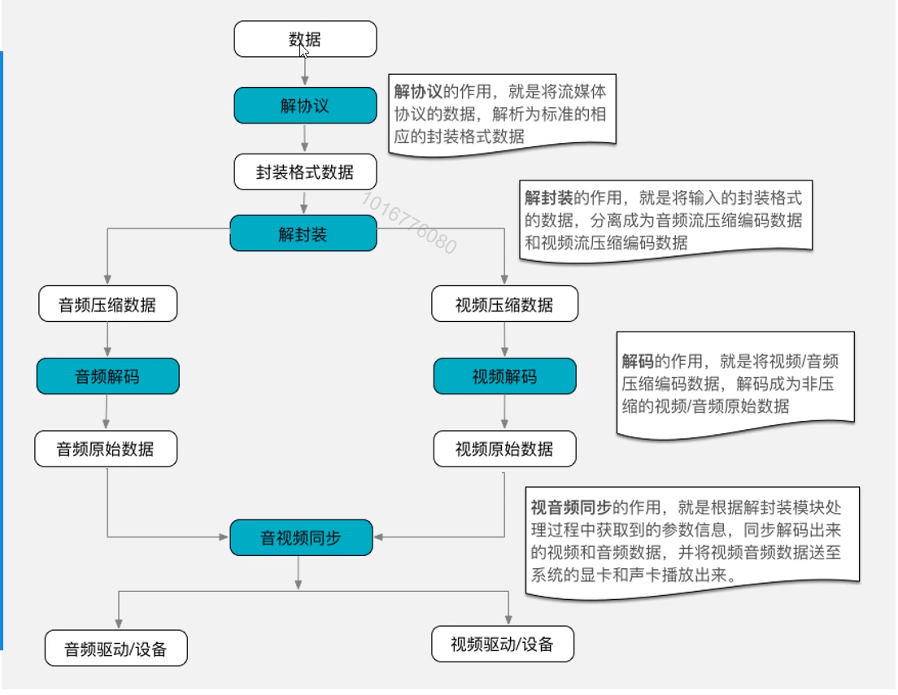

## 一、FFmpeg的集成

## 一 、编译ffmpeg (Ubuntu 18.10 x64系统)
### 1 下载
```shell
wget https://ffmpeg.org/releases/ffmpeg-4.1.tar.bz2
//需使用 低于17 的ndk 版本，不然会无法编译
wget https://dl.google.com/android/repository/android-ndk-r17-linux-x86_64.zip
```
### 2 解压
```shell
.tar.gz     格式解压为          tar   -zxvf   xx.tar.gz
.tar.bz2    格式解压为          tar   -jxvf   xx.tar.bz2
zip					unzip file.zip
```

### 3 编译
#### 1 编译armeabi-v7a的脚本

~~~shell
//创建文件夹
mkdir files
//创建文件夹
touch file.txt
//修改权限
 chmod 777 xx.sh
~~~


```shell
#!/bin/bash
 #shell脚本第一行必须是指定shell脚本解释器，这里使用的是bash解释器
 
 #一系列命令的集合 cd xx;dir
 
 #ndk r17
 
 make clean
 
 #指令的集合
 
 #执行ffmpeg 配置脚本
 #--prefix 安装、输出目录 so、a的输出目录 javac -o
 #--enable-cross-compile 开启交叉编译器
 #--cross-prefix 编译工具前缀 指定ndk中的工具给这个参数
 #--disable-shared 关闭动态库
 #--disable-programs 关闭程序的编译 ffmpeg ffplay
 #--extra-cflags 给编译的参数
 
 export NDK=/home/ndk/android-ndk-r17
 export SYSROOT=$NDK/platforms/android-21/arch-arm/
 export TOOLCHAIN=$NDK/toolchains/arm-linux-androideabi-4.9/prebuilt/linux-x86_64
 export CPU=arm
 export PREFIX=$(pwd)/android/$CPU
 
 #给编译器的变量
 #定义变量 值从FFmpeg_Player\app\.externalNativeBuild\cmake\release\armeabi-v7a\build.ninja 复制的
 FLAG="-isystem $NDK/sysroot/usr/include/arm-linux-androideabi -D__ANDROID_API__=21 -g -DANDROID -ffunction-sections -funwind-tables -fstack-protector-strong -no-canonical-prefixes -march=armv7-a -mfloat-abi=softfp -mfpu=vfpv3-d16 -mthumb -Wa,--noexecstack -Wformat -Werror=format-security  -Os -DNDEBUG  -fPIC"
 
 INCLUDES="-isystem $NDK/sources/cxx-stl/gnu-libstdc++/4.9/include -isystem $NDK/sources/cxx-stl/gnu-libstdc++/4.9/libs/armeabi-v7a/include -isystem $NDK/sources/cxx-stl/gnu-libstdc++/4.9/include/backward"
 
 ./configure \
 --target-os=android \
 --prefix=$PREFIX \
 --arch=arm \
 --enable-shared \
 --disable-static \
 --disable-yasm \
 --enable-gpl \
 --disable-ffmpeg \
 --disable-ffplay \
 --disable-ffprobe \
 --disable-doc \
 --disable-symver \
 --cross-prefix=$TOOLCHAIN/bin/arm-linux-androideabi- \
 --enable-cross-compile \
 --sysroot=$SYSROOT \
 --extra-cflags="-isysroot $NDK/sysroot $FLAG $INCLUDES" \
 --extra-ldflags="$ADDI_LDFLAGS" \
 $ADDITIONAL_CONFIGURE_FLAG
 make clean
 make
 make install
```

#### 2 编译arm64-v8a的脚本 
```shell
#!/bin/bash
#shell脚本第一行必须是指定shell脚本解释器，这里使用的是bash解释器

#一系列命令的集合 cd xx;dir

#ndk r17

make clean

#指令的集合

#执行ffmpeg 配置脚本
#--prefix 安装、输出目录 so、a的输出目录 javac -o
#--enable-cross-compile 开启交叉编译器
#--cross-prefix 编译工具前缀 指定ndk中的工具给这个参数
#--disable-shared 关闭动态库
#--disable-programs 关闭程序的编译 ffmpeg ffplay
#--extra-cflags 给编译的参数

export NDK=/home/ndk/android-ndk-r17
export SYSROOT=$NDK/platforms/android-21/arch-arm64/
export TOOLCHAIN=$NDK/toolchains/aarch64-linux-android-4.9/prebuilt/linux-x86_64
export CPU=arm64
export PREFIX=$(pwd)/android/$CPU

#给编译器的变量
#定义变量 值从FFmpeg_Player\app\.externalNativeBuild\cmake\release\arm64-v8a\build.ninja 复制的                                                                                      
FLAG="-isystem $NDK/sysroot/usr/include/aarch64-linux-android -D__ANDROID_API__=21 -g -DANDROID -ffunction-sections -funwind-tables -fstack-protector-strong -no-canonical-prefixes -Wa,--noexecstack -Wformat -Werror=format-security  -O2 -DNDEBUG  -fPIC"

INCLUDES="-isystem $NDK/sources/cxx-stl/gnu-libstdc++/4.9/include -isystem $NDK/sources/cxx-stl/gnu-libstdc++/4.9/libs/arm64-v8a/include -isystem $NDK/sources/cxx-stl/gnu-libstdc++/4.9/include/backward"

./configure \
--target-os=android \
--prefix=$PREFIX \
--arch=aarch64 \
--disable-shared \
--enable-static \
--disable-yasm \
--enable-gpl \
--disable-ffmpeg \
--disable-ffplay \
--disable-ffprobe \
--disable-doc \
--disable-symver \
--cross-prefix=$TOOLCHAIN/bin/aarch64-linux-android- \
--enable-cross-compile \
--sysroot=$SYSROOT \
--extra-cflags="-isysroot $NDK/sysroot $FLAG $INCLUDES" \
--extra-ldflags="$ADDI_LDFLAGS" \
$ADDITIONAL_CONFIGURE_FLAG
make clean
make
make install 
```

#### 3 编译步骤
```shell
 1 修改文件权限 
    chmod 777 xx.sh
 2 开始编译
    sh xx.sh
```

## 二  ffmpeg 在 android studio 中的配置

### 1 CmakeLists语法

   * cmake_minimum_required(VERSION 3.4.1)

```cmake
用来设置编译本地native library的时候需要的Cmake最小版本.
```

   * add_library()

```cmake
add_library( # Sets the name of the library.
             native-lib

# Sets the library as a shared library.
SHARED

# Provides a relative path to your source file(s).
src/main/cpp/native-lib.cpp )
****
native-lib : 设置本地lib的name 
SHARED : 表示编译生成的是动态链接库 
src/main/cpp/native-lib.cpp : 表示编译文件的相对路径,这里可以是一个文件的路径也可以是多个文件的路径
```

   * find_library()

```cmake
find_library( # Sets the name of the path variable.
              log-lib

              # Specifies the name of the NDK library that
              # you want CMake to locate.
              log )
这个的作用是用来让我们加一些编译本地NDK库的时候所用的到一些依赖库. 
log-lib 是这个库的别名,方便我们以后引用 
log 是我们调试的时候打印log的一个库
```

   * target_link_libraries() 

```cmake
target_link_libraries( # Specifies the target library.
                       native-lib

                       # Links the target library to the log library
                       # included in the NDK.
                       ${log-lib} )
                       
这个的目的是用来关联我们本地的库跟第三方的库.这里就是把native-lib库和log库关联起来.
```

###  2 ffmpeg 在Android Studio 中 CmakeLists 的用法

   * 设置生成的so动态库最后输出的路径  

```cmake
set(CMAKE_LIBRARY_OUTPUT_DIRECTORY ${PROJECT_SOURCE_DIR}/jniLibs/${ANDROID_ABI})
```

   * 设置头文件路径

```cmake
set(INCLUDE_DIR ${CMAKE_SOURCE_DIR}/src/main/jni/include)
#设置头文件路径，在代码中include时不需要带路径了
include_directories(${INCLUDE_DIR}/ffmpeg ${INCLUDE_DIR}/libyuv)       
```

  * 设置编译文件路径


```cmake
add_library( # Sets the name of the library.
             player

             # Sets the library as a shared library.
             SHARED

             # Provides a relative path to your source file(s).
             src/main/jni/player.c )
```

  * 设置导入的路径


```cmake
set(LIB_DIR ${CMAKE_SOURCE_DIR}/src/main/jniLibs)

add_library(avcodec SHARED IMPORTED)
# 设置导入的路径
set_target_properties(avcodec
                      PROPERTIES IMPORTED_LOCATION
                      ${LIB_DIR}/${ANDROID_ABI}/libavcodec.so)

add_library(avdevice SHARED IMPORTED)
set_target_properties(avdevice
                      PROPERTIES IMPORTED_LOCATION
                      ${LIB_DIR}/${ANDROID_ABI}/libavdevice.so)

add_library(avfilter SHARED IMPORTED)
set_target_properties(avfilter
                      PROPERTIES IMPORTED_LOCATION
                      ${LIB_DIR}/${ANDROID_ABI}/libavfilter.so)

add_library(avformat SHARED IMPORTED)
set_target_properties(avformat
                      PROPERTIES IMPORTED_LOCATION
                      ${LIB_DIR}/${ANDROID_ABI}/libavformat.so)

add_library(avutil SHARED IMPORTED)
set_target_properties(avutil
                      PROPERTIES IMPORTED_LOCATION
                      ${LIB_DIR}/${ANDROID_ABI}/libavutil.so)

add_library(postproc SHARED IMPORTED)
set_target_properties(postproc
                      PROPERTIES IMPORTED_LOCATION
                      ${LIB_DIR}/${ANDROID_ABI}/libpostproc.so)

add_library(swresample SHARED IMPORTED)
set_target_properties(swresample
                      PROPERTIES IMPORTED_LOCATION
                      ${LIB_DIR}/${ANDROID_ABI}/libswresample.so)

add_library(swscale SHARED IMPORTED)
set_target_properties(swscale
                      PROPERTIES IMPORTED_LOCATION
                      ${LIB_DIR}/${ANDROID_ABI}/libswscale.so)

add_library(yuv SHARED IMPORTED)
set_target_properties(yuv
                      PROPERTIES IMPORTED_LOCATION
                      ${LIB_DIR}/${ANDROID_ABI}/libyuv.so)
```

  * 关联第三方库


```cmake
target_link_libraries( # Specifies the target library.
                      player
                      avcodec
                      avdevice
                      avfilter
                      avformat
                      avutil
                      postproc
                      swresample
                      swscale
                      yuv
   
                      # Links the target library to the log library
                      # included in the NDK.
                      # 使用native_window需要引入，android这里是简写，也可以仿照log-lib去写
                      android
                      ${log-lib} )
```

   * CMakeLIsts  文件配置    

     ~~~ cmake 
     # For more information about using CMake with Android Studio, read the
     # documentation: https://d.android.com/studio/projects/add-native-code.html
     
     # Sets the minimum version of CMake required to build the native library.
     
     cmake_minimum_required(VERSION 3.4.1)
     
     
     # 一、 定义工程名
     project(FfmpegAndroid)
     
     # 二、设置头文件搜索路径，本地工程与第三方库
     include_directories(${CMAKE_SOURCE_DIR}/./src)
     
     # 三、设置日志输出
     message(STATUS " CMAKE_ANDROID_ARCH_ABI : ${CMAKE_ANDROID_ARCH_ABI}")
     MESSAGE("----NATIVE_CLIENT_VERSION_INFO=" ${NATIVE_CLIENT_VERSION_INFO})
     add_compile_options(-DNATIVE_CLIENT_VERSION_INFO="${NATIVE_CLIENT_VERSION_INFO}")
     
     # 四、递归的方式，添加所有的源文件到变量中
     file(GLOB_RECURSE glob_source_files "${CMAKE_CURRENT_SOURCE_DIR}/./src/*.c" "${CMAKE_CURRENT_SOURCE_DIR}/./src/*.cpp" "${CMAKE_CURRENT_SOURCE_DIR}/./src/*.cc")
     
     
     # 五、设置lib的生成路径
     set(CMAKE_LIBRARY_OUTPUT_DIRECTORY ${CMAKE_SOURCE_DIR}/libs/${CMAKE_ANDROID_ARCH_ABI})
     
     # 六、添加需要链接的第三方搜索路径  静态库链接
     
     # LINK_DIRECTORIES(${CMAKE_SOURCE_DIR}/jni/thirdparty/event/lib)
     
     # 七、设置编译的动态库
     add_library(FfmpegAndroid SHARED ${glob_source_files})
     
     # 八、链接第三方库以及系统库
     target_link_libraries(FfmpegAndroid -llog -lz 
     -avfilter -avformat -avcodec -avutil
             swresample swscale
             z
             OpenSLES
             android
     )
     
     ~~~

### 3 编译
```java
1 java类中创建native方法
2 在编译后的文件 在debug 目录下使用
        javah -jni -encoding UTF-8 com.xxx.xx.xxx
```


#  二、视频播放

## 一、播放流程


* 音/视频解码流程
    * 1、打开文件        -> AVFormatContext
    * 2、寻找音视频数据
    * 3、通过解码方式找到对于的解码器  -> AVCodecContext
    * 4、打开解码器
    * 5、读取音/视频包 -> AVPacket
    * 6、将包的数据给解码器
    * 7、从解码器得到原始数据包 -> AVFrame
    * 8、视频开始绘制/音频播放声音

## 二、视频解码

* 1、引入ffmpeg库以及相关系统库

  ~~~c++
  #include <string>
  #include <android/native_window_jni.h>
  #include <zconf.h>
  
  extern "C"{
  #include "libavcodec/avcodec.h"
  #include <libswscale/swscale.h>
  #include <libavutil/imgutils.h>
  #include <libavformat/avformat.h>
  }
  ~~~

* 2、打开文件

  ~~~c++
   	//初始化网络
  	avformat_network_init();
      AVFormatContext * formatContext = avformat_alloc_context();
      //1、打开URL
      AVDictionary *opts = NULL;
      //设置超时3秒
      av_dict_set(&opts, "timeout", "3000000", 0);
  
  	//强制指定AVFormatContext中AVInputFormat的。这个参数一般情况下可以设置为NULL，这样FFmpeg可以自动检测AVInputFormat。
      //输入文件的封装格式
  //    av_find_input_format("avi")
  //    ret为零 表示成功
      int ret = avformat_open_input(&formatContext, path, NULL, &opts);
  
  ~~~

* 3、获取数据流

  ~~~c++
  avformat_find_stream_info(formatContext, NULL);
  ~~~

* 4、找到视频流和对应的解码器,再将解码器打开

  ~~~c++
  //视频时长（单位：微秒us，转换为秒需要除以1000000） 
      int vidio_stream_idx=-1;
  
      for (int i = 0; i < formatContext->nb_streams; ++i) {
          if (formatContext->streams[i]->codecpar->codec_type == AVMEDIA_TYPE_VIDEO) {
              vidio_stream_idx=i;
              break;
          }
      }
  
  	//找到解码参数
      AVCodecParameters *codecpar = formatContext->streams[vidio_stream_idx]->codecpar;
      //找到解码器
      AVCodec *dec = avcodec_find_decoder(codecpar->codec_id);
  AVCodecContext *codecContext = avcodec_alloc_context3(dec);
  	//讲解码器参数copy到解码器上下文
      avcodec_parameters_to_context(codecContext, codecpar);
  	//打开解码器
      avcodec_open2(codecContext, dec, NULL);
  ~~~

* 5、读取数据包 yuv数据

  ~~~c++
      //读取包
      AVPacket *packet = av_packet_alloc();
  
   while (av_read_frame(formatContext, packet)>=0) {
          avcodec_send_packet(codecContext, packet);
          AVFrame *frame = av_frame_alloc();
          ret = avcodec_receive_frame(codecContext, frame);
          if (ret == AVERROR(EAGAIN)) {
              //需要更多数据
              continue;
          } else if (ret < 0) {
              break;
          }
    //...对读取的数据进行操作   
   }
  
  
  ~~~

* 6、拿到数据进行转换 gpb

  ~~~c++
  //转化的上下文
   SwsContext *sws_ctx = sws_getContext(
              codecContext->width, codecContext->height, codecContext->pix_fmt,
              codecContext->width, codecContext->height, AV_PIX_FMT_RGBA,
              SWS_BILINEAR, 0, 0, 0);
  
  ~~~

  

  ~~~c++
  //设置容器的大小
  uint8_t *dst_data[0];
          int dst_linesize[0];
          av_image_alloc(dst_data, dst_linesize,
                         codecContext->width, codecContext->height, AV_PIX_FMT_RGBA, 1);   
  
  
  //转为指定的YUV420P
      sws_scale(sws_ctx,reinterpret_cast<const uint8_t *const *>(frame->data), frame->linesize, 0,
                            frame->height,
                            dst_data, dst_linesize);
  ~~~

* 7、进行渲染

  ~~~c++
  //设置window  
  
      ANativeWindow *nativeWindow = ANativeWindow_fromSurface(env, surface);
  //    视频缓冲区
      ANativeWindow_Buffer outBuffer;
      //创建新的窗口用于视频显示
  //    ANativeWindow
      int frameCount = 0;
      ANativeWindow_setBuffersGeometry(nativeWindow, codecContext->width,
                                       codecContext->height,
                                       WINDOW_FORMAT_RGBA_8888);
  
  
     if (packet->stream_index == vidio_stream_idx) {
  //非零   正在解码
              if (ret==0) {
  // 开始渲染
   ANativeWindow_lock(nativeWindow, &outBuffer, NULL);
  //     h 264   ----yuv          RGBA
                 
  //rgb_frame是有画面数据
                  uint8_t *dst= (uint8_t *) outBuffer.bits;
  //            拿到一行有多少个字节 RGBA
                  int destStride=outBuffer.stride*4;
                  uint8_t *src_data = dst_data[0];
                  int src_linesize = dst_linesize[0];
                  uint8_t *firstWindown = static_cast<uint8_t *>(outBuffer.bits);
                  for (int i = 0; i < outBuffer.height; ++i) {
                      //内存拷贝 来进行渲染
                      memcpy(firstWindown + i * destStride, src_data + i * src_linesize, destStride);
                  }
                  ANativeWindow_unlockAndPost(nativeWindow);
                  usleep(1000 * 16);
                  av_frame_free(&frame);
  
              }
     }
  ~~~

  

* 8、释放资源

  ~~~c++
  	ANativeWindow_release(nativeWindow);
      avcodec_close(codecContext);
      avformat_free_context(formatContext);
  ~~~
  
  
  
  

## 三、音频解码

* 1、设置采样率，导入解码库

  ~~~c++
  //采样率
  #define MAX_AUDIO_FRME_SIZE 48000 * 4
  
  //解码库
  extern  "C"{
  //封装格式
  #include "libavformat/avformat.h"
  //解码
  #include "libavcodec/avcodec.h"
  //缩放
  #include "libswscale/swscale.h"
  //重采样
  #include "libswresample/swresample.h"
  };
  
  ~~~

  

* 2、打开音频文件

  ~~~c++
  	avformat_network_init();
  //    总上下文
      AVFormatContext * formatContext = avformat_alloc_context();
      //打开音频文件
      if(avformat_open_input(&formatContext,input,NULL,NULL) != 0){
          LOGI("%s","无法打开音频文件");
          return;
      }
  
  ~~~

  

* 3、获取输入文件信息(数据流)

  ~~~c++
   //获取输入文件信息
      if(avformat_find_stream_info(formatContext,NULL) < 0){
          LOGI("%s","无法获取输入文件信息");
          return;
      }
  ~~~

* 4、找到音频流并获取对应的解码器，再将解码器打开

  ~~~c++
   //视频时长（单位：微秒us，转换为秒需要除以1000000）
  //找到音频流
      int audio_stream_idx=-1;
      for (int i = 0; i < formatContext->nb_streams; ++i) {
          if (formatContext->streams[i]->codecpar->codec_type == AVMEDIA_TYPE_AUDIO) {
              audio_stream_idx=i;
              break;
          }
      }
  
      AVCodecParameters *codecpar = formatContext->streams[audio_stream_idx]->codecpar;
      //找到解码器
      AVCodec *dec = avcodec_find_decoder(codecpar->codec_id);
  
   //创建上下文
      AVCodecContext *codecContext = avcodec_alloc_context3(dec);
      avcodec_parameters_to_context(codecContext, codecpar);
      avcodec_open2(codecContext, dec, NULL);
  ~~~

* 5、获取输入的音频参数(采样格式、采样率、输入声道布局),设置输出音频参数(mp3 -> pcm)

  ~~~c++
  //    输入的这些参数
      AVSampleFormat in_sample =  codecContext->sample_fmt;
      // 输入采样率
      int in_sample_rate = codecContext->sample_rate;
      //    输入声道布局
      uint64_t in_ch_layout=codecContext->channel_layout;
  
  
  //        输出参数  固定
  
  //    输出采样格式
      AVSampleFormat out_sample=AV_SAMPLE_FMT_S16;
  //    输出采样
      int out_sample_rate=44100;
  //    输出声道布局
      uint64_t out_ch_layout = AV_CH_LAYOUT_STEREO;
  ~~~

  

* 6、创建音频转换器，并初始化

  ~~~c++
  
    SwrContext *swrContext = swr_alloc();
  //设置转换器 的输入参数 和输出参数
      swr_alloc_set_opts(swrContext,out_ch_layout,out_sample,out_sample_rate
              ,in_ch_layout,in_sample,in_sample_rate,0,NULL);
  //    初始化转换器其他的默认参数
      swr_init(swrContext);
      uint8_t *out_buffer = (uint8_t *)(av_malloc(2 * 44100));
  
  ~~~

  

* 7、读取数据包 

  ~~~c++
          //读取包  压缩数据
      AVPacket *packet = av_packet_alloc();
      int count = 0;
      //    设置音频缓冲区间 16bit   44100  PCM数据
  //            输出 值
      while (av_read_frame(formatContext, packet)>=0) {
          avcodec_send_packet(codecContext, packet);
      }
  ~~~

  

* 8、对数据进行解码

  ~~~c++
  //解压缩数据  未压缩
          AVFrame *frame = av_frame_alloc();
  //        c    指针
          int ret = avcodec_receive_frame(codecContext, frame);
  //        frame
          if (ret == AVERROR(EAGAIN))
              continue;
          else if (ret < 0) {
              LOGE("解码完成");
              break;
          }
          if (packet->stream_index!= audio_stream_idx) {
              continue;
          }
          LOGE("正在解码%d",count++);
  ~~~

* 9、对数据进行转换，讲数据转成设置好的输出数据

  ~~~c++
  //frame  ---->统一的格式
          swr_convert(swrContext, &out_buffer, 2 * 44100,
                      (const uint8_t **)frame->data, frame->nb_samples);
          int out_channerl_nb= av_get_channel_layout_nb_channels(out_ch_layout);
  //缓冲区的 大小
          int out_buffer_size=  av_samples_get_buffer_size(NULL, out_channerl_nb, frame->nb_samples, out_sample, 1);
  ~~~

  

* 10、关闭资源

  ~~~c++
      fclose(fp_pcm);
      av_free(out_buffer);
      swr_free(&swrContext);
      avcodec_close(codecContext);
      avformat_close_input(&formatContext);
  ~~~

  

##  四、音视频编码详解

* 音频概念

  

  

* 音频编码

  

* 什么是视频

  

* 数字视频

  

* 数字视频系统的构成和运行原理

  

* 人类视觉系统HVS

  

* HVS视频设计考虑因素

  

* 什么是RGB色彩空间

  

* RGB转YUV

  .png)

  .png)

* 何为YUV分量采样

  


## 五、音视频同步

* 音频播放 openSL

  * 1、初始化输出参数 (ffmpeg)

    ~~~c++
    
       swr_ctx = swr_alloc_set_opts(0, AV_CH_LAYOUT_STEREO, AV_SAMPLE_FMT_S16, out_sample_rate,
                                     avCodecContext.channel_layout,
                                     avCodecContext.sample_fmt,
                                     avCodecContext.sample_rate, 0, 0);
        swr_init(swr_ctx);
    
     //根据布局获取声道数  
        out_channels = av_get_channel_layout_nb_channels(AV_CH_LAYOUT_STEREO);
        out_samplesize = av_get_bytes_per_sample(AV_SAMPLE_FMT_S16);
        out_sample_rate = 44100;
        //CD音频标准
        //44100 双声道 2字节    out_samplesize  16位  2个字节   out_channels  2
        buffer = (uint8_t *) malloc(out_sample_rate * out_samplesize * out_channels);
    ~~~

  * 2、初始化openSL
    ~~~c++
     //音频引擎
        SLEngineItf engineItfFace = NULL;
        //音频对比
        SLObjectItf engineObject = NULL;
        //混音器
        SLObjectItf outputMixObject = NULL;

        //播放器
        SLObjectItf bqPlayerObject = NULL;
        //回调接口
        SLPlayItf bqPlayerInterface = NULL;
        //缓冲队列
        SLAndroidSimpleBufferQueueItf bqPlayerBufferQueue = NULL;

        SLresult result;

        //初始化播放引擎
        result = slCreateEngine(&engineObject, 0, NULL, 0, NULL, NULL);
        if (SL_RESULT_SUCCESS != result) {
            return;
        }

        result = (*engineObject)->Realize(engineObject, SL_BOOLEAN_FALSE);

        if (SL_RESULT_SUCCESS != result) {
            return;
        }

        //音频接口相当于surfaceHodler
        result = (*engineObject)->GetInterface(engineObject, SL_IID_ENGINE, &engineItfFace);
        if (result != SL_RESULT_SUCCESS) {
            return;
        }

        //初始化混音器outputMixObject
          result =  (*engineItfFace)->CreateOutputMix(engineItfFace, &outputMixObject, 0, 0, 0);
        result = (*outputMixObject)->Realize(outputMixObject, SL_BOOLEAN_FALSE);
        SLDataLocator_AndroidSimpleBufferQueue android_queue = {SL_DATALOCATOR_ANDROIDSIMPLEBUFFERQUEUE,
                                                                2};
        //pcm数据格式
        SLDataFormat_PCM pcm = {SL_DATAFORMAT_PCM,//播放pcm格式的数据
                                2,//2个声道(立体声)
                                SL_SAMPLINGRATE_44_1,//44100hz的频率
                                SL_PCMSAMPLEFORMAT_FIXED_16,//位数 16位
                                SL_PCMSAMPLEFORMAT_FIXED_16,
                                SL_SPEAKER_FRONT_LEFT | SL_SPEAKER_FRONT_RIGHT,//立体声(钱左 前右)
                                SL_BYTEORDER_LITTLEENDIAN//小端模式
        };


        SLDataLocator_OutputMix outputMix = {SL_DATALOCATOR_OUTPUTMIX, outputMixObject};

        SLDataSink audioSnk = {&outputMix, NULL};
        SLDataSource slDataSource = {&android_queue, &pcm};
        const SLInterfaceID ids[1] = {SL_IID_BUFFERQUEUE};
        const SLboolean req[1] = {SL_BOOLEAN_TRUE};

        (*engineItfFace)->CreateAudioPlayer(
                engineItfFace,
                &bqPlayerObject,//播放器
                &slDataSource,//播放器参数 播放缓冲队列 播放格式
                &audioSnk,//播放缓冲区
                1,//播放接口回调个数
                ids,//设置播放队列 ID
                req//是否采用内置的播放队列
        );
        //初始化播放器
        (*bqPlayerObject)->Realize(bqPlayerObject, SL_BOOLEAN_FALSE);
        //得到接口后调用 获取player接口
        (*bqPlayerObject)->GetInterface(bqPlayerObject, SL_IID_PLAY, &bqPlayerInterface);
        //获得播放器接口
        (*bqPlayerObject)->GetInterface(bqPlayerObject, SL_IID_BUFFERQUEUE, &bqPlayerBufferQueue);

        (*bqPlayerBufferQueue)->RegisterCallback(bqPlayerBufferQueue, bqPlayerCallback, this);

        //设置播放状态
        (*bqPlayerInterface)->SetPlayState(bqPlayerInterface, SL_PLAYSTATE_PLAYING);
        bqPlayerCallback(bqPlayerBufferQueue, this);
    ~~~

   * 3、播放音频数据
    ~~~c++
    void bqPlayerCallback(SLAndroidSimpleBufferQueueItf bq, void *context) {
    //
        AudioChannel *audioChannel = static_cast<AudioChannel *>(context);
        int datalen = audioChannel->getPcm();
        if (datalen > 0) {
            (*bq)->Enqueue(bq, audioChannel->buffer, datalen);
        }
    //pcm数据   原始音频数据
    }


int AudioChannel::getPcm() {
    AVFrame *frame = 0;
    int data_size = 0;
    while (isPlaying) {
        int ret = frameQueue.deQueue(frame);
//转换
        if (!isPlaying) {
            break;
        }
        if (!ret) {
            continue;
        }
        uint64_t dst_nb_samples = av_rescale_rnd(
                swr_get_delay(swr_ctx, frame->sample_rate) + frame->nb_samples,
                out_sample_rate,
                frame->sample_rate,
                AV_ROUND_UP);
        // 转换，返回值为转换后的sample个数  buffer malloc（size）
        int nb = swr_convert(swr_ctx, &buffer, dst_nb_samples,
                             (const uint8_t **) frame->data, frame->nb_samples);
//      //转换后多少数据  buffer size  44110*2*2
        data_size = nb * out_channels * out_sampleSize;
//        0.05s
        clock= frame->pts * av_q2d(time_base);

        break;
    }
    releaseAvFrame(frame);
    return data_size;
}
    ~~~

* 音视频同步解决方案

  * 音频为准

    > 以音频为准，视频与音频同步，音频只管播放，视频有超前和延后。
        如果视频超前就放慢速度，                                        ----->睡眠时间加长
        如果延后减少视频播放等待时间，                                   播放关键帧，进行超赶
        如果延后很严重，队列积累时间过长，这直接丢弃，进入最新解码帧。     不睡眠

  * 视频为准

    > 视频画面每次循环不变，音频根据视频来延迟或等待。

* 音频为准

  * 1、获取视频的帧率，表示1s播放多少帧，1/帧率，表示，休眠多少时间进行渲染。

  * pts 显示时间戳，dps 渲染时间戳。time_base ffmpeg的时间单位。

  * 播放时间=pts *av_q2d(time_base)  

    > 1、pts 时间进度，数量。
    >
    > 2、time_base是时间刻度，(1,25)时间刻度就是 1/25,每一份是0.04s

* 设置视频播放位置

  ~~~c++
  //1 上下问
  //2 流索引 -1，表示选择的时默认流
  //3 要seek到的时间戳
  //4 seek的方式。 AVSEEK_FLAG_BACKWARD:表示seek到请求的时间戳之前
  //最靠近的一个关键帧。
  av_seek_frame(formatContext,-1,playProgress*AV_TIME_BASE<
               AVSEEK_FLAG_BACKWARD)
  ~~~

  

  


