# 第一节 UML建模

## 一、PowerDesigner 安装

* 下载安装包并解压

* 安装

## 二、正向工程与逆向工程

* 逆向工程

  > 第一步 (语言-Reverse Engineer Java)
  >
  > 第二步 (添加java)

* 正向工程

  > 第一步 (语言-Generate Java Code)
  >
  > 第二步：选择生成文件和路径
  >
  > 第三部：查看生成的java文件

## 三、关系(依赖、泛化)

* 依赖(Dependence)

  > A类持有B类的引用，这种关系称为依赖关系,例如房子里面有车，车依赖房子

  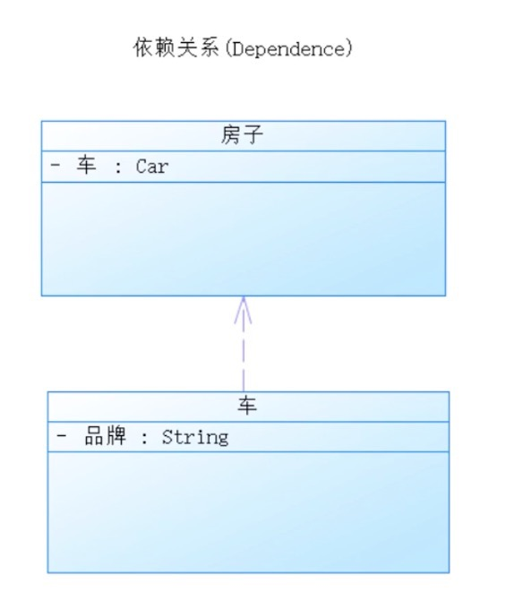

* 泛化(Generalization)

  > 泛化关系 类似 java 的继承关系 。男人与女人都是人类
  >
  > B 类 具有A类 所有的属性和方法，并具有自己特有的属性和方法。

  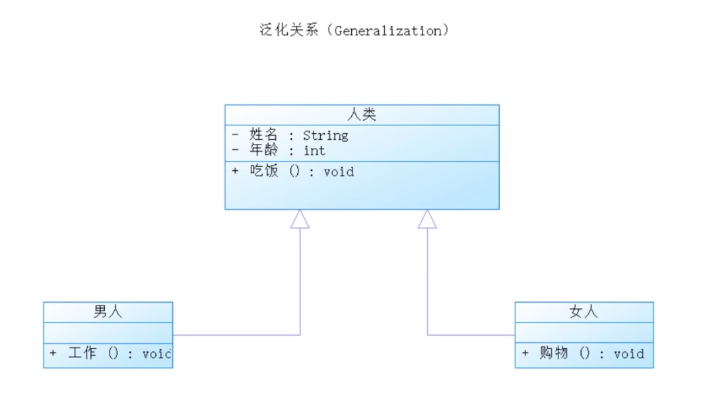

* 关联(Association)

  > 1 单向关联  地址 对应  城市
  >
  > 2 双向关联   男孩有女孩，女孩有男孩
  >
  > 3 自关联   

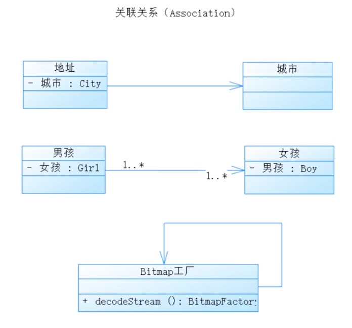

* 实现(Realization)

  > 类似java中的接口实现  usb（断开，连接） ->u盘、键盘、鼠标 

  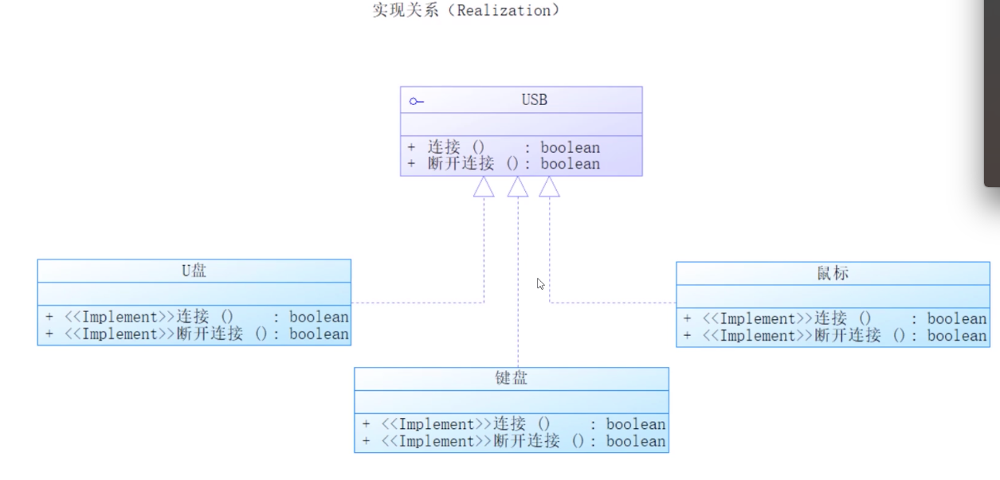

* 聚合(Aggregation)  

  > 表示整体和部分的关系，可以分开。单独存在  ; 学生 既可以是学校，也可以在网吧打游戏

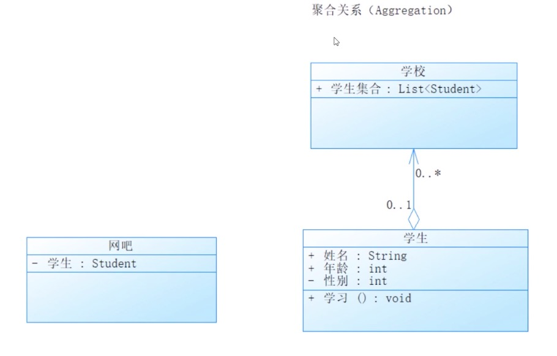

* 组合(Composition)

  > 与聚合类似，但是整体跟部分不能分开。 例如ViewGroup 与View 的关系

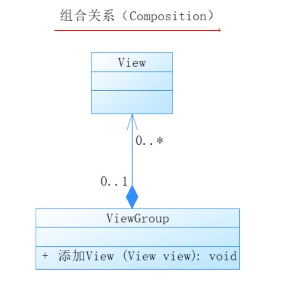

## 四、AOP面向切面架构设计

* 两种方式

    aop 通过动态代理和预编译的方式,可以对业务逻辑各个部分进行分离,各个业务之间的耦合度降低,提高程序的可重用性.

  * 第一种方式

    >  	view 				 view
    >
    > ​        Proxy not null
    >
    > ​		mVIew.method();

  * 第二种方式

    > ​       	  activity						activity
    >
    > ​			 Activity All Callback LIstener
    >
    > ​			 做Activity生命周期业务处理

* 理解切面

  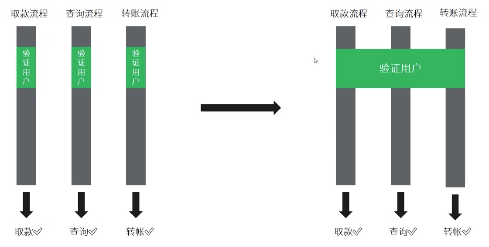

* 动态代码切面需求

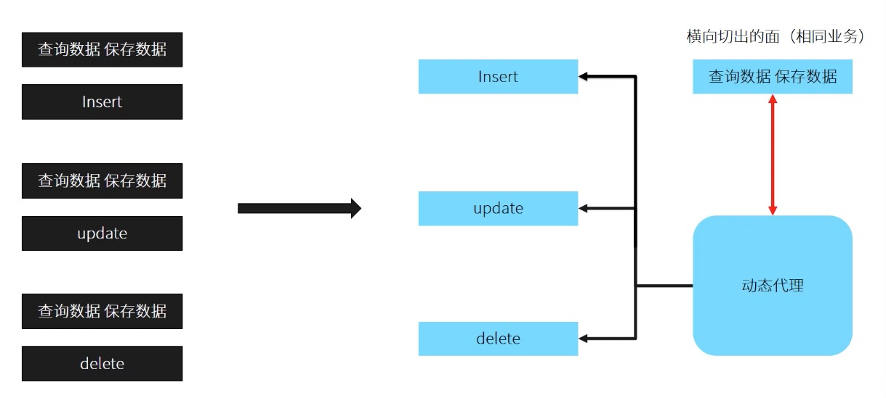

## 五、面向切面思想之集中式登录架构

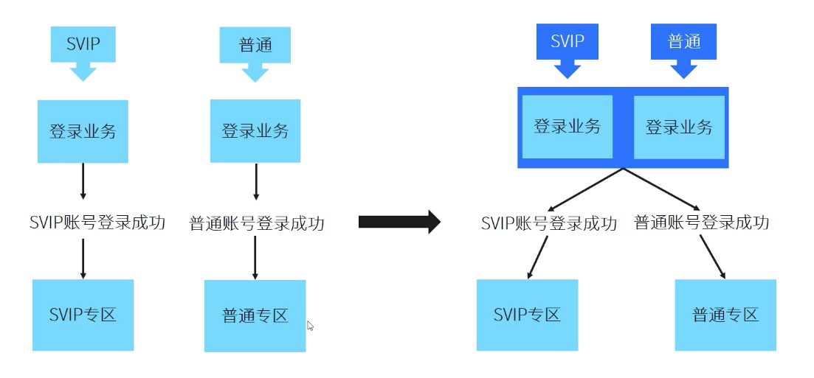

* AspectJrt  （Ioc 容器）

  * 5.1、gradle 配置 

    ~~~java
    //在buildscript中添加该编织器，gradle构建时就会对class文件进行编织
    classpath 'org.aspectj:aspectjweaver:1.8.9'
    //在dependencies中添加该依赖，提供@AspectJ语法
    compile 'org.aspectj:aspectjrt:1.8.9'
        
    版权声明：本文为CSDN博主「David-Kuper」的原创文章，遵循CC 4.0 BY-SA版权协议，转载请附上原文出处链接及本声明。
    原文链接：https://blog.csdn.net/woshimalingyi/article/details/73252013
    ~~~

  * 5.2、连接点- **JoinPoint**   

    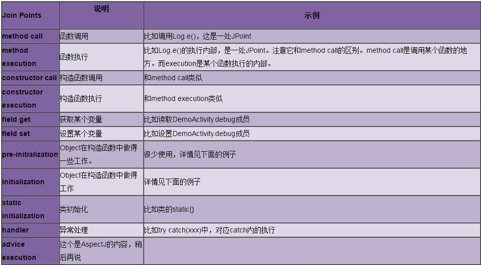

  * 5.3、切入点 - **PointCut**

    示例代码

    ~~~java
     @Pointcut("execution(@com.netease.aop.login.annotation.LoginCheck * *(..))")
     public void methodPointCut() {}
    ~~~

    直接选择

    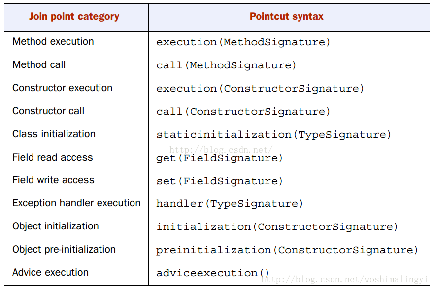

    间接选择

    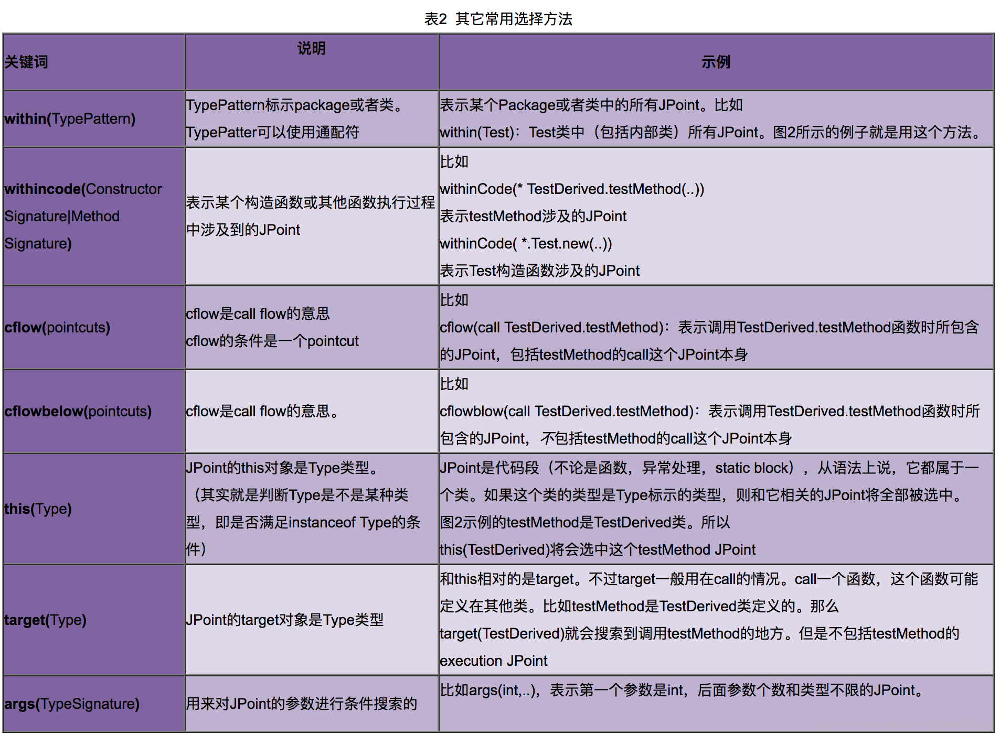

  * 5.4、 **匹配规则** 

    * 5.4.1、**类型匹配语法** 

      >  *：匹配任何数量字符；
      > ..：匹配任何数量字符的重复，如在类型模式中匹配任何数量子包；而在方法参数模式中匹配任何数量参数。
      > +：匹配指定类型的子类型；仅能作为后缀放在类型模式后边。
      > AspectJ使用 且（&&）、或（||）、非（！）来组合切入点表达式。 

    * 5. 4.2、**匹配模式** 

       call(<注解？> <修饰符?> <返回值类型> <类型声明?>.<方法名>(参数列表) <异常列表>？) 

      * 精确匹配

        ~~~java
        //表示匹配 com.davidkuper.MainActivity类中所有被@Describe注解的public void方法。
        @Pointcut("call(@Describe public void com.davidkuper.MainActivity.init(Context))")
        public void pointCut(){}
        ~~~

      * 单一模糊匹配

        ~~~java
        //表示匹配 com.davidkuper.MainActivity类中所有被@Describe注解的public void方法。
        @Pointcut("call(@Describe public void com.davidkuper.MainActivity.*(..)) ")
        public void pointCut(){}
        
        //表示匹配调用Toast及其子类调用的show方法，不论返回类型以及参数列表，并且该子类在以com.meituan或者com.sankuai开头的包名内
        @Pointcut("call(* android.widget.Toast+.show(..)) && (within(com.meituan..*)|| within(com.sankuai..*))")
        public void toastShow() {
        }
        ~~~

      * 组合模糊匹配

        ~~~java
        //表示匹配任意Activity或者其子类的onStart方法执行，不论返回类型以及参数列表，且该类在com.meituan.hotel.roadmap包名内
        @Pointcut("execution(* *..Activity+.onStart(..))&& within(com.meituan.hotel.roadmap.*)")
        public void onStart(){}
        ~~~

      * 

    * 5.4.3、 **获取参数** 

      * 通过声明参数语法arg()显示获取参数

        ~~~java
        @Around(value = "execution(* BitmapFacade.picasso.init(java.lang.String,java.lang.String)) && args(arg1,arg2)"
        public Object aroundArgs(String arg1,String arg2,ProceedingJoinPoint joinPoint){
           System.out.println("aspects arg = " + arg1.toString()+" " + arg2);
           Object resutObject = null;
           try {
              resutObject = joinPoint.proceed(new Object[]{arg1,arg2});
           } catch (Throwable e) {
              e.printStackTrace();
           }
           return resutObject;
        }
        ~~~

      * 通过joinPoint.getArg()获取参数列表

        ~~~java
        @Around("execution(static * tBitmapFacade.picasso.init(..)) && !within(aspectj.*) ")
        public void pointCutAround(ProceedingJoinPoint joinPoint){
           Object resutObject = null;
           try {
              //获取参数列表
              Object[] args = joinPoint.getArgs();
              resutObject = joinPoint.proceed(args);
           } catch (Throwable e) {
              e.printStackTrace();
           }
           return resutObject;
        };
        ~~~

    * 5.4.4、 **异常匹配** 

      ~~~java
      /**
      * 截获Exception及其子类报出的异常。
      * @param e 异常参数
      */
      @Pointcut("handler(java.lang.Exception+)&&args(e)")
      public void handle(Exception e) {}
      ~~~

  * 5.5、**通知——Advise**

    *  **@Before、@After** 

      ~~~java
      //所有实例方法调用截获
      private static final String INSTANCE_METHOD_CALL =
      "call(!static * com.meituan.hotel.roadmap..*.*(..))&&target(Object)";
      @Pointcut(INSTANCE_METHOD_CALL) public void instanceMethodCall() {
      }
      //实例方法调用前后Advice
      @Before("instanceMethodCall()") public void beforInstanceCall(JoinPoint joinPoint) {
      printLog(joinPoint, "before instance call");
      }
      @After("instanceMethodCall()") public void afterInstanceCall(JoinPoint joinPoint) {
      printLog(joinPoint, "after instance call");
      }
      ~~~

    *  **@Around** 

      ~~~java
      //横切项目中所有Activity的子类，以Layout命名、以及它的子类的所有方法的执行
      private static final String POINTCUT_METHOD =
      "(execution(* android.app.Activity+.*(..)) ||execution(* *..Layout+.*(..)))&& within(com.meituan.hotel.roadmap.*)";
      @Pointcut(POINTCUT_METHOD) public void methodAnnotated() {
      }
      
      @Around("methodAnnotated()") public Object weaveJoinPoint(ProceedingJoinPoint joinPoint)throws Throwable{
         //调用原方法的执行。
         Object result = joinPoint.proceed();
         return result;
      }
      ~~~

    *  **@AfterThrowing** 

      ~~~java
      /**
      * 在异常抛出后，该操作优先于下一个切点的@Before()
      * @param joinPoint
      * @param e 异常参数
      */
      @AfterThrowing(pointcut = "afterThrow()",throwing = "e")
      public void afterThrowing(JoinPoint joinPoint,Exception e){
      Log.e(TAG,joinPoint.getTarget().getClass().getSimpleName() + " afterThrowing() :" + e.toString());
      }
      ~~~

      

  * 

    

​           

​	  

