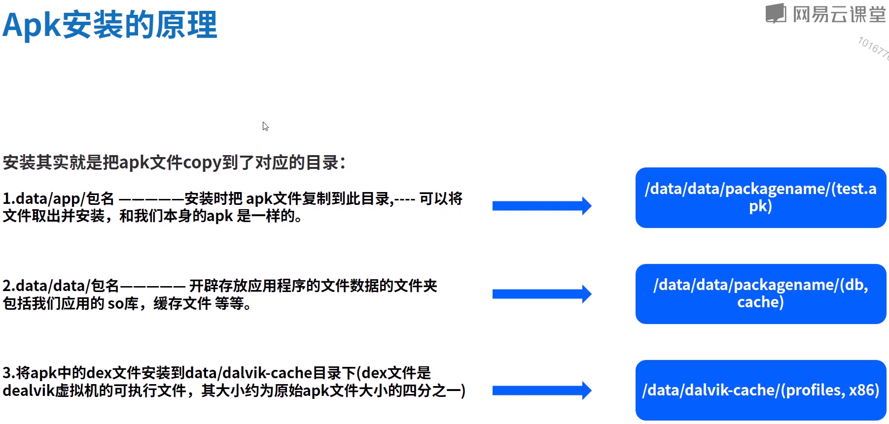

# Android系统源码分析

## 一、handler

## 二、binder原理

## 三、PMS源码分析

* 架构图

  

  * 通过context 获取到PMS的的代理类，通过操作 代理类，获取到pms的数据

## 四、apk安装原理

* 
* 有界面安装
* 无界面安装

## 五、ActvityManger架构设计

* 关系图

  

* startService
  

## 六、app启动流程

