# 设计模式

## 一、MVC

* mvc流程关系:
  * view接收到用户的操作
  * view将用户的操作，交给controller
  * controller完成具体业务逻辑
  * 得到结果封装model，再进行view 更新
* controller 是作为一个媒介，处理model和view之间。model和view之间有紧密的联系，耦合性偏强。

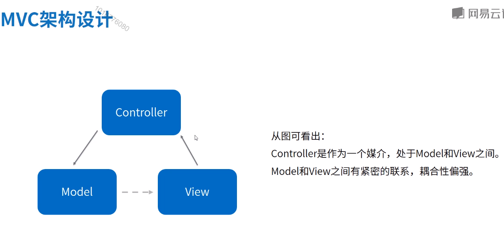

* 三层模型

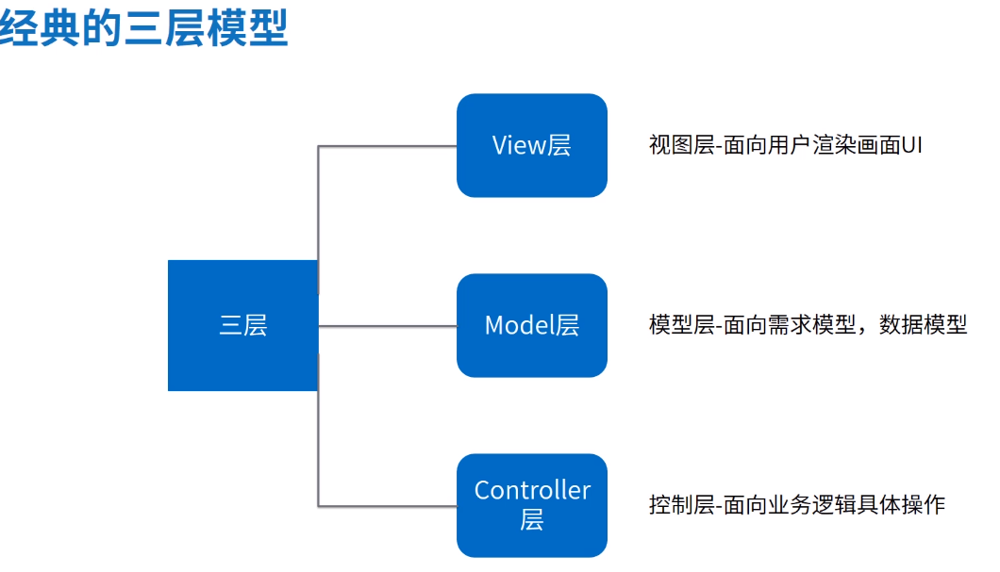

* 三层模型在Android中的体现

  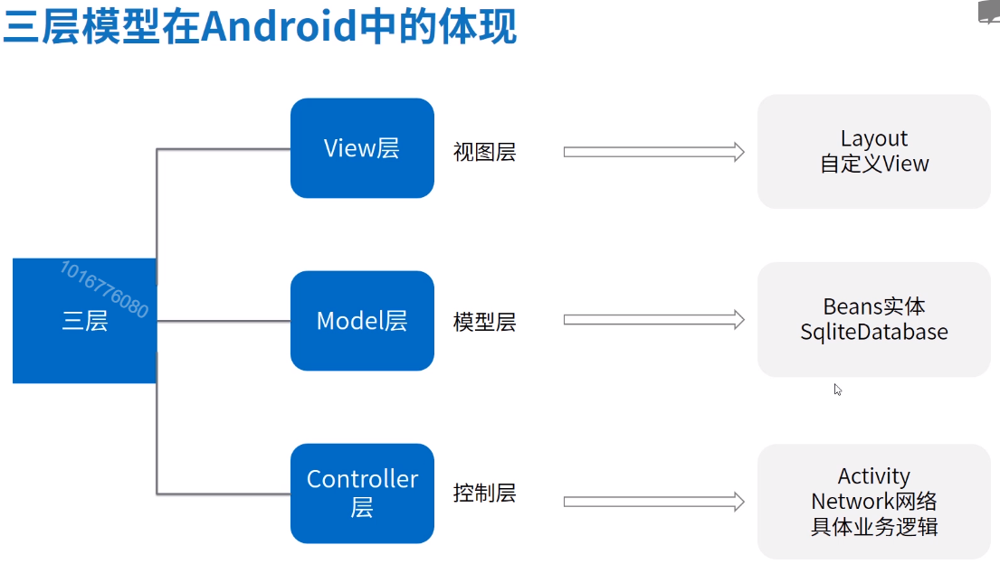

## 二、Mvp

* 模型

  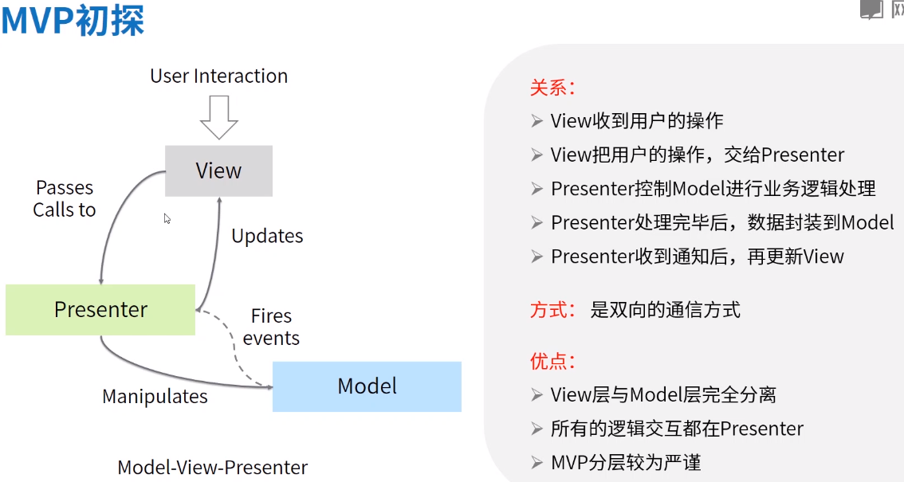

* 思想精髓

  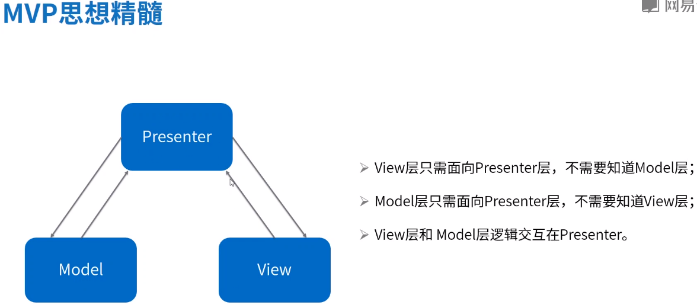

* 解耦View与model

  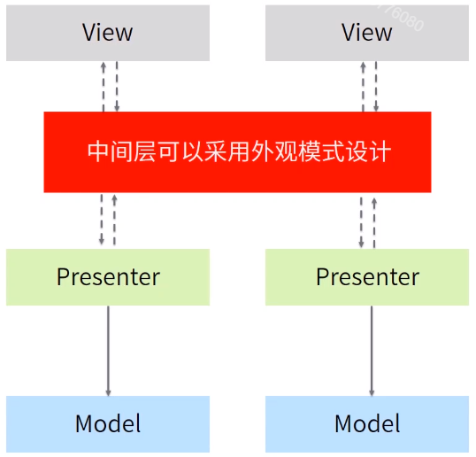

* 基础框架搭建

  

## 三、Mvvm

* 模型

  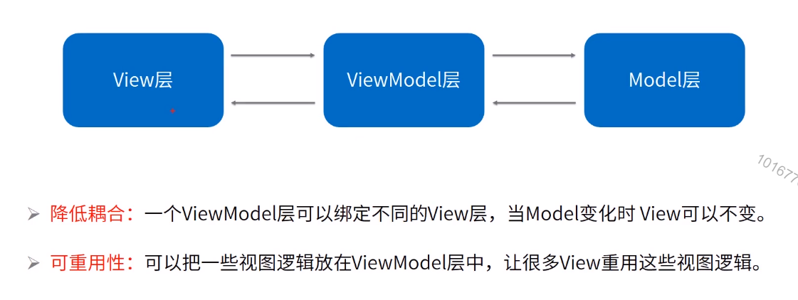

* 关系

  

* v层布局绑定 流程

  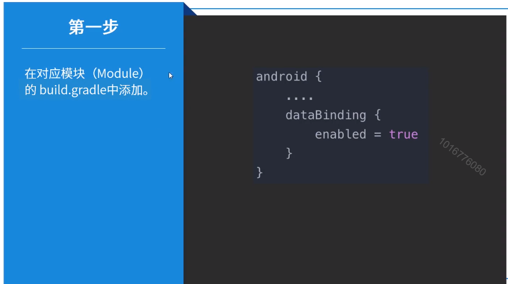

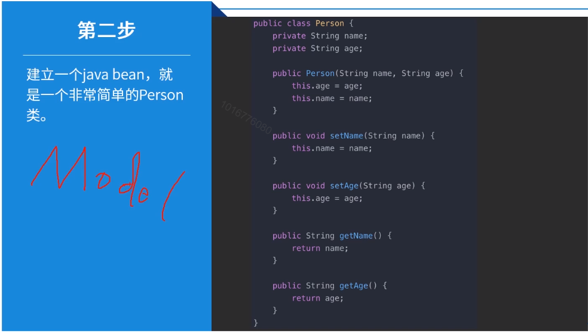

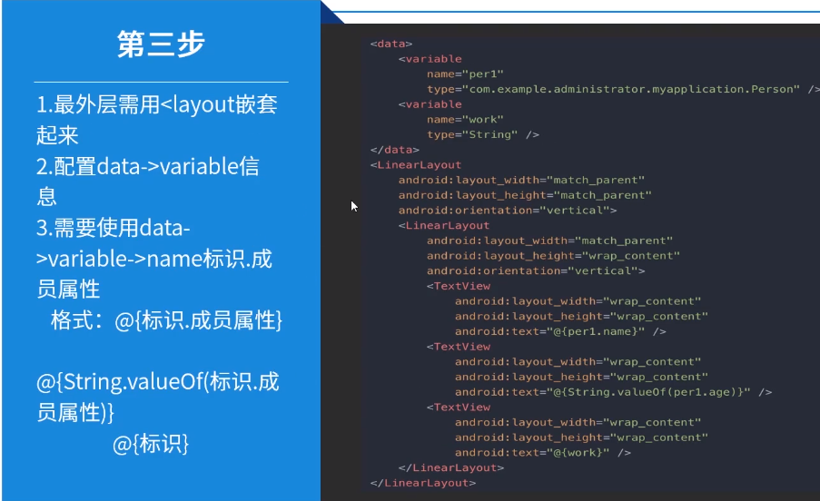

* databing绑定原理

  * APT预编译方式

    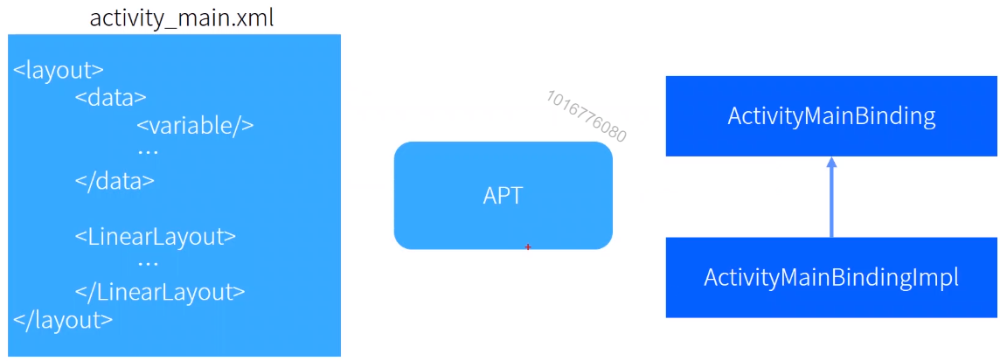

    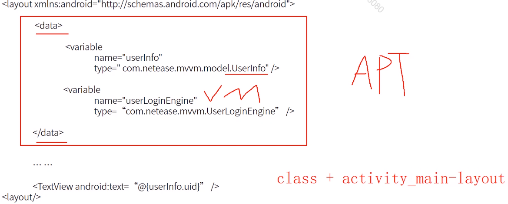

  * 内部处理布局文件控件

    

  * model帮助类

    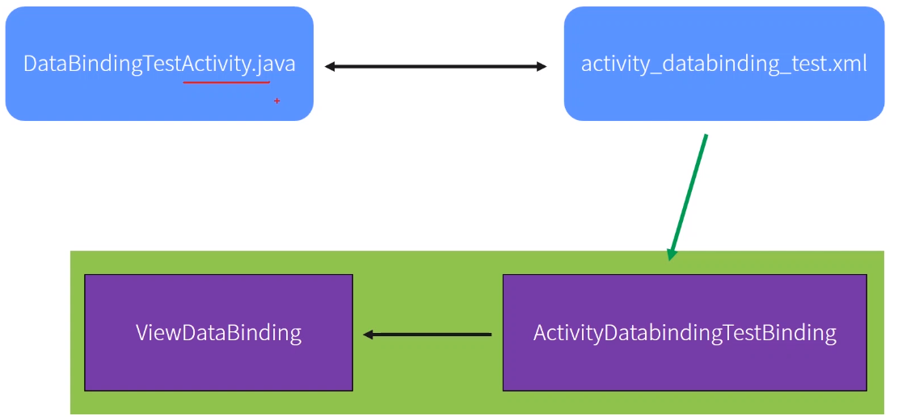

    

